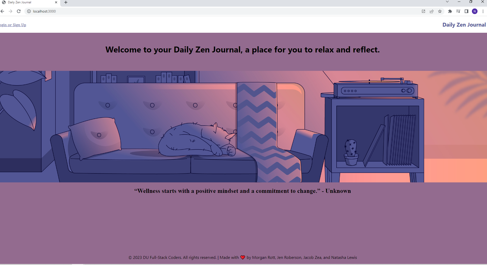
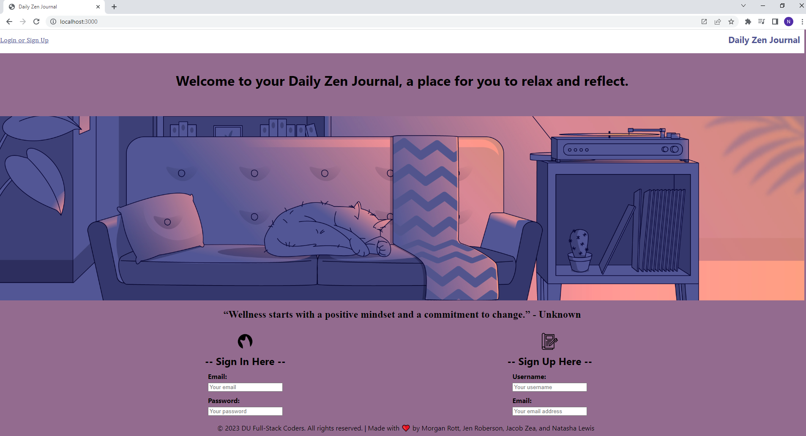
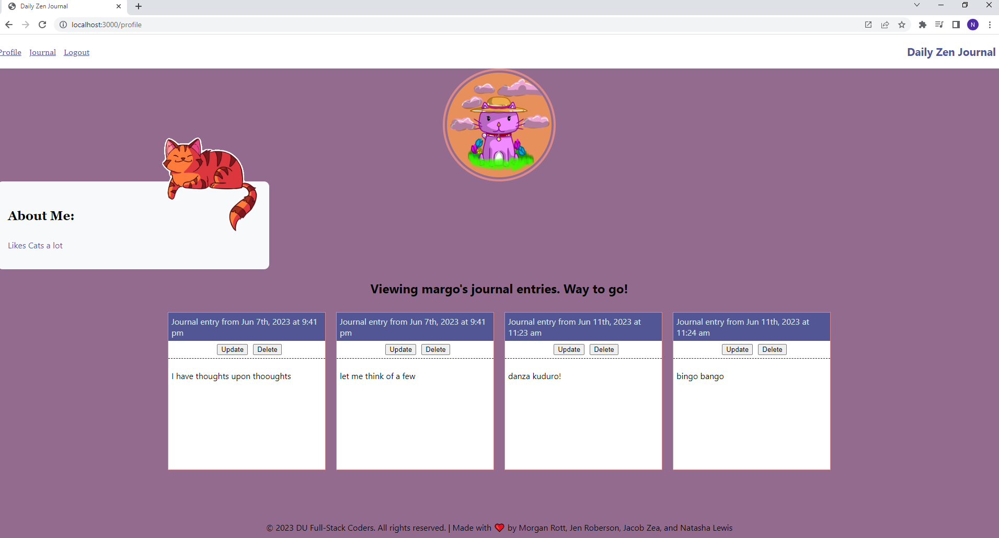
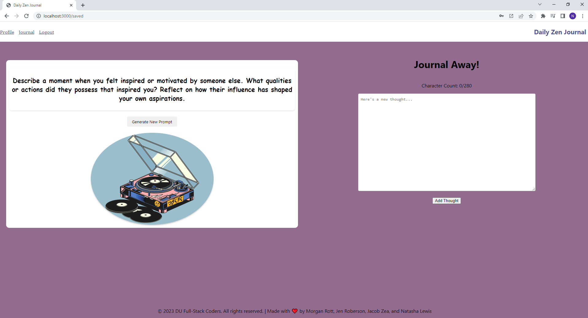

# Daily Zen Journal

## Description

This is a simple journaling app that allows users to create entries and view them in a list, while also providing daily journaling prompts to help users get started. Users can also edit and delete entries. This app uses authentication to allow users to create accounts and log in and out and provide a safe and private place to relax and reflect.

## Table of Contents

- [Installation](#installation)
- [Usage](#usage)
- [License](#license)
- [Features](#features)
- [Screentshots](#screenshots)
- [Contact](#contact)

## Installation

Techologies used:

``` React, Expressjs, Nodejs, JWT, Graphql, react-kawaii, bootstrap, mongoose, @apollo/client, apollo-server-express ```

To install necessary dependencies, run the following command:

``` npm install ```

## Usage
 To run the app, run the following command:

``` npm start ```


## License


## Features

* Users can create an account and log in and out
* Users can create, edit, and delete journal entries
* Users can view a list of their entries
* Users can view a list of daily journaling prompts
* Users can see the date of their entries


## Screenshots










## Contact

* Project Github: https://github.com/mrott0397/daily-zen-journal
- Natasha Lewis: nlewis742 Email: nlackas12@gmail.com
- Jacob Zea: JacobZ96 Email: Jacobzea96@gmail.com
- Jen Roberson: jrob02180 Email: jrob02180@gmail.com
- Morgan Rott: mrott0397 Email: todo978@gmail.com

## Deployed Link

https://stark-cliffs-80324.herokuapp.com/
